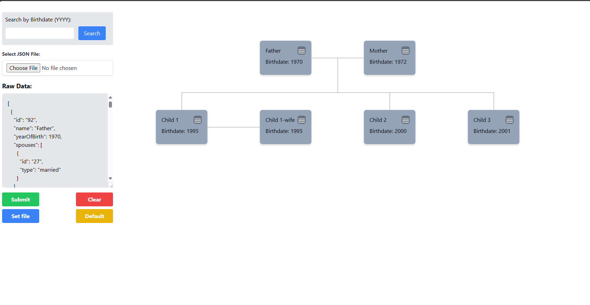
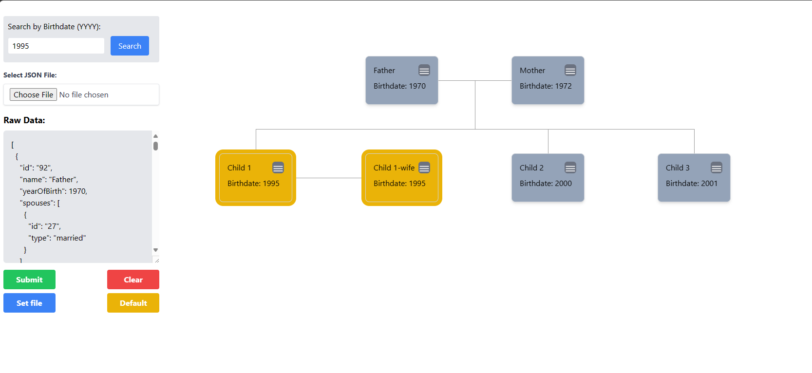
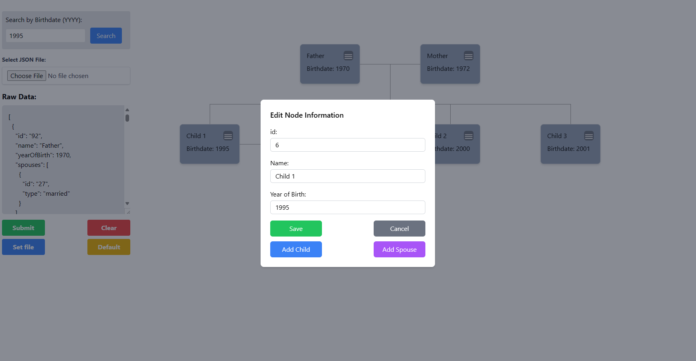
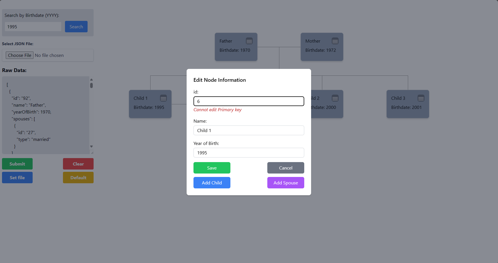
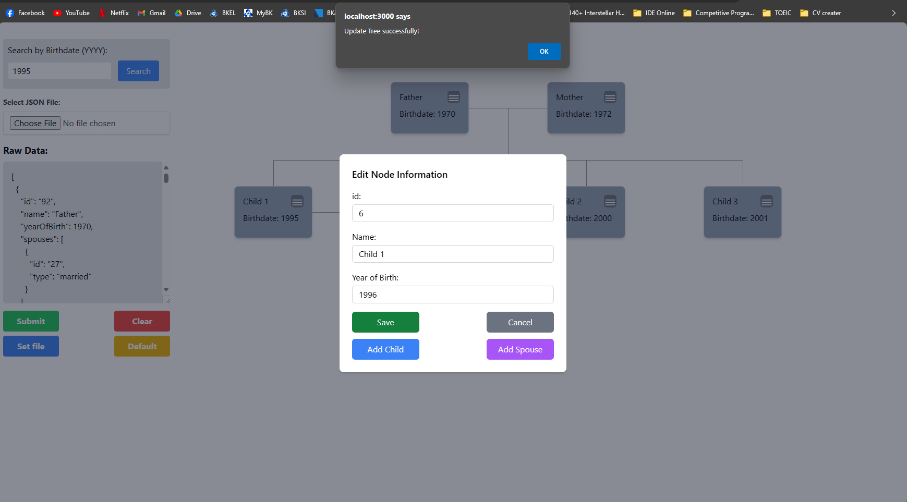
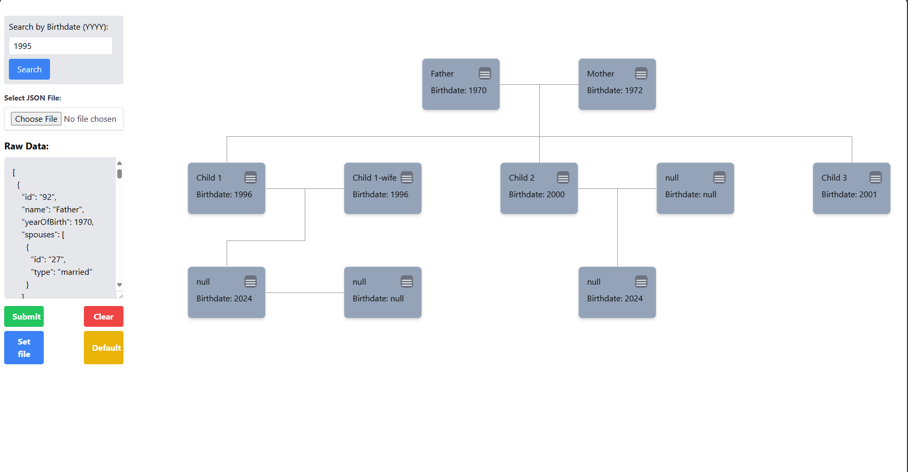

# Task-3

This project was bootstrapped with [Create React App](https://github.com/facebook/create-react-app).

## Available Scripts

In the project directory, to install all the dependencies you can run:
```
npm install
```
Runs the app in the development mode:
```
npm start
```
Open [http://localhost:3000](http://localhost:3000) to view it in your browser.

## Screens

### 1. Render on your own data
- Pages allow to upload a json file
- You can edit directly on the text area (typing, copy/paste)
- `Submit` button to submit the data in the text area
- `Set File` button to set the data to the file you uploaded, if you have not uploaded any file, it will set to the default file.
- `Default` button to set the data to the default file.
- `Clear` button to clear all the contents in the text area.
> If the data submitted is wrong, you will get an alert pop-up



### 2. Find user that has birthed in the year YYYY
- All the node matched the year YYYY from the search input will by highlighted.
- The highlighted node will be back to normal state in 2 seconds.



### 3. Add Child, Spouse, edit node information
- View node information



- Edit node information (If you want to edit the id, there will be a warning show-up)





- Add Child, Spouse (Cannot add a new spouse if the node already have a spouse)



## Deployed website
```
```